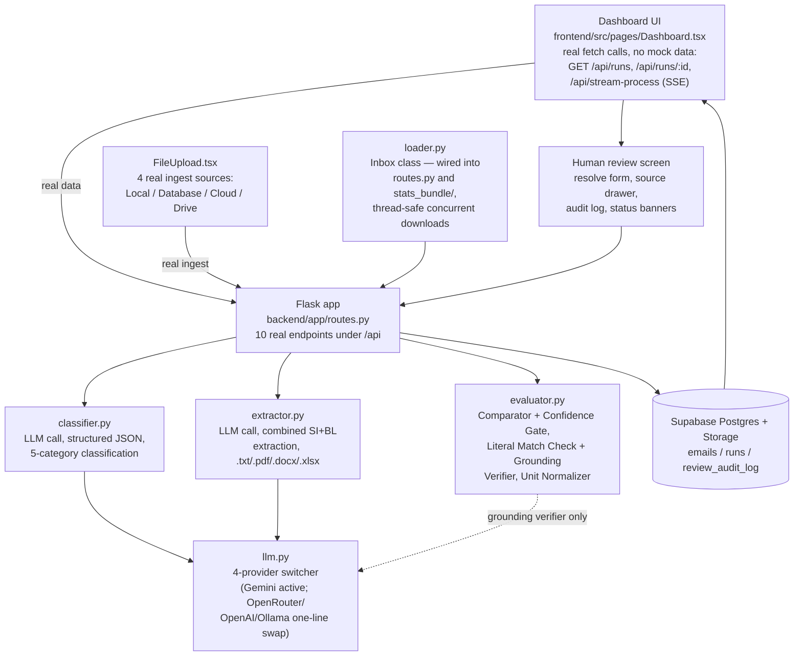
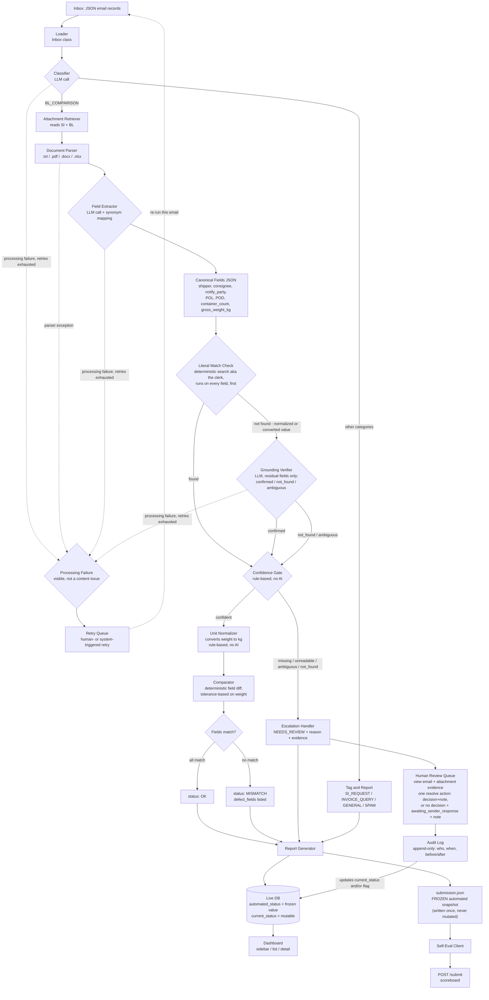

# Minion Lens — Shipping Document Verification PRD

## TL;DR

We're building **Minion Lens**: an AI-assisted pipeline that reads a shared shipping-ops inbox, works out which emails are document-comparison requests, checks the attached **Shipping Instruction (SI)** against the draft **Bill of Lading (BL)** across 7 required fields, and reports exactly what matches, what doesn't, and what it isn't sure about — instead of a human reading every email and eyeballing two documents side by side.

---

## 1. The Problem

A shipping-ops team runs one shared inbox that mixes together document-checking requests, new shipping-instruction requests, invoice questions, general updates, and spam. Three separate problems stack on top of each other:

**1a. Triage is manual and slow.** Someone has to open every email, decide what kind of request it is, and route it — in a high-volume, mixed-content mailbox. A document-check request that gets missed in the pile never reaches the checking step at all, and nobody notices until it's a shipping delay.

**1b. Cross-document comparison is repetitive and error-prone by hand.** For a document-check request, staff compare a **Shipping Instruction (SI)** — the customer's original, authoritative statement of what should ship — against a **draft Bill of Lading (BL)** — the carrier's draft of what they're about to ship. Seven fields have to match: shipper, consignee, notify party, port of loading, port of discharge, container count, and gross weight (kg). Eyeballing two documents field-by-field is exactly the kind of task where humans miss things, especially under volume, and a missed mismatch becomes a real-world shipping error, correction, or delay.

**1c. The same fact is written differently in every document.** The SI might say "Port of Loading"; the BL might say "Load Port." A consignee's legal name might appear slightly differently, or the same physical address might be filed under two different company names (this happens in our own sample data — see below). A naïve system that string-matches field labels will do one of two bad things: **miss a real discrepancy** (it can't find the field in both documents, so it never even runs the comparison), or **flag a false mismatch** (it thinks a field is "missing" when it's just labeled differently). Either failure mode erodes trust in the tool faster than doing the check by hand.

**Worked example from the hackathon's own sample data** (`reference/sdoc-hackathon-bundle/inbox/email_004.json`): the SI lists the consignee as *EAST BRIGHT FZ-LLC*; the BL lists the consignee ("To the Order of") as *UAB NOVAKOPA* — same address, different legal entity name. A field-label mismatch is easy; this is a **value** mismatch masquerading as a formatting quirk, and it's the kind of thing the system has to flag, not explain away.

**Who feels this.** The shipping-ops staff who currently do this by hand (fewer errors, less tedious reading); the customers whose shipments get delayed by a caught-late discrepancy; and, in the hackathon context, the judges scoring us on *Problem Statement Understanding* (10 pts) and *Practical Value & Potential* (10 pts) — they're checking that we understand this is a real operational bottleneck, not a toy classification exercise.

---

## 2. The Solution

**Minion Lens** turns the inbox into a **pipeline** — a fixed sequence of processing stages, not an autonomous agent looping on its own decisions (see the terminology note in §2.2). Every email goes in one end, and a clear, structured result comes out the other end. Nobody has to read every email by hand to know what needs attention. Full technical detail is in **Architecture**; this section is the shape of the idea and the vocabulary we'll all use for it.

**In one analogy:** think of it as a small shipping office adding one new hire and one strict process, instead of asking the existing staff to read every letter and cross-check every document by hand.

- **The intern** (an AI reader) opens each letter, decides what it's about, and — for a real document-check request — reads the two attached documents and copies the 7 key facts from each onto a clean form, translating differently-worded labels into the same box because they understand English, not just exact wording.
- **The accountant** (plain, boring code — no AI) runs a strict checklist over the finished forms: is anything blank? does a page look unreadable? does this look like the wrong kind of document? If it passes, the accountant lays the two forms side by side and checks all 7 boxes match — no interpretation, just a diff.
- **The supervisor** (a human reviewer) only gets involved when the accountant's checklist fails. They see exactly which email and attachment triggered it, and either make the call directly or note that the sender needs to be asked for a clearer copy — nothing is guessed or hidden, and the report that goes to head office reflects what the intern-and-accountant team decided *on their own*, not a corrected answer (§2.4-C).

That's the version we're building first (Tier 1, §7). Two more roles join once that loop is solid end to end: a **word-search clerk** who mechanically double-checks the intern's trickier translations before they're trusted (§2.4-B), and a few other refinements sequenced deliberately after the core works, not before (§7).

### 2.1 The core idea in one sentence

Use a language model **only** for the two steps that genuinely need judgment — reading messy human language and matching two documents' worth of shipping jargon by *meaning* — and use plain deterministic code for every step where a wrong answer would be unacceptable (routing, the actual field-by-field diff, and deciding whether to trust the result at all).

### 2.2 Terminology (so we all mean the same thing)

| Term | Meaning in this project |
| --- | --- |
| **SI (Shipping Instruction)** | The customer's original statement of intended shipment details. Treated as the source of truth. |
| **BL (Bill of Lading, draft)** | The carrier's draft document being checked against the SI before it's finalized. |
| **Canonical field** | One of the 7 shipment attributes we compare, identified by *meaning* regardless of the label each document uses for it (e.g. "Port of Loading" and "Load Port" both map to `port_of_loading`), and, for `gross_weight_kg`, regardless of source unit (see Unit Normalizer). |
| **Classification** | Sorting an email into one of 5 categories: `BL_COMPARISON`, `SI_REQUEST` (new-SI request), `INVOICE_QUERY`, `GENERAL`, `SPAM`. Only `BL_COMPARISON` continues to document checking. |
| **Extraction** | Pulling the 7 canonical fields out of a document's raw text, regardless of label, layout, or file format. |
| **Literal Match Check** | A deterministic (not AI), free, mechanical search that checks whether an extracted value appears verbatim (or near-verbatim) in the source text — runs on every field, first. Nicknamed "the clerk" internally. If it finds a match, the field is trusted with no LLM involvement at all (see §2.4-B). |
| **Grounding verification** | An LLM check that only runs on the fields the Literal Match Check *couldn't* confirm — i.e. values that are correct but don't look like the source text because they were normalized or converted. Confirms per field: `confirmed` / `not_found` / `ambiguous` (see §2.4-B). |
| **Unit Normalizer** | A deterministic (not AI) step that converts an extracted weight to a canonical unit (kg) using a fixed conversion table, so the SI and BL are compared on the same scale — see §2.4-E. |
| **Comparison** | The deterministic, code-only diff of the 7 extracted (and, for weight, normalized) SI fields against the 7 BL fields. |
| **Confidence gate** | A rule-based (not AI) checkpoint that decides whether the extracted data is trustworthy enough to compare automatically, or needs a human. |
| **NEEDS_REVIEW / human-in-the-loop escalation** | The outcome when the system can't complete the task confidently — it hands the case to a person with the evidence and the specific reason, instead of guessing. |
| **Pipeline** *(what this is)* | A fixed sequence of processing stages that data flows through — classify, extract, verify, gate, compare, report — where the control flow (what runs next) is decided entirely by deterministic code, not by the model. This is the accurate word for our architecture. |
| **Harness** *(what this isn't, despite our own early sketch calling it that)* | In current AI-engineering usage, a "harness" is the scaffolding around a model that lets *it* decide what to do next — tool calls, an agent loop, retries the model itself triggers. We don't have that: every LLM call happens at a fixed point with fixed inputs, and the branching is all plain code. Calling this a "pipeline" (or "workflow") is more accurate than "harness," and we should say so consistently, including out loud to judges. |
| **Guardrails** | Specifically the checks that decide whether to *trust* a given LLM output before anything downstream relies on it: the Confidence Gate, the Grounding Verifier, and structured/schema-constrained output (§4.10). Escalation, the audit log, and the frozen-submission design are *consequences* of a guardrail catching something (or a deliberate scoring-integrity choice) — worth keeping that distinction precise rather than calling everything built around the AI a "guardrail." |

### 2.3 The five things the system has to do (from the brief)

1. **Classify** — tell request types apart, including spam.
2. **Extract** — read SI and BL attachments and pull out the 7 shipment fields, however they're labeled.
3. **Compare** — diff the values, show SI vs. BL side by side, flag only what actually differs.
4. **Ask for help** — escalate to a human with context when it can't decide, rather than guessing or failing silently.
5. **Explain itself** — every result should be auditable: which email, what was compared, why a verdict was reached.

### 2.4 Guardrail decisions (grilled and resolved as a team)

Our own schedule doc (`SUNphUMores Schedule and Info`) sketched a workflow with a real tension in it, plus two gaps the sketch didn't cover. Here's where the team landed on each:

**(A) "Validate LLM on LLM" vs. a deterministic safety net — resolved: deterministic.** The tagline in our early sketch said "use LLM to validate on LLM," but the detailed walkthrough argued the opposite — that the safety net shouldn't depend on the same kind of model that might have just made the mistake. **Decision: the confidence gate and the comparator stay 100% rule-based code, no LLM call in either.** Reproducible, auditable, and cheap. (See (B) below for the one deliberate, narrow exception.)

**(B) The confidence gate can't catch a clean-looking but wrong extraction — resolved: a deterministic check first, LLM grounding only on the residual.** Null/garbled/wrong-doc-type checks don't catch a value that's present, well-formatted, and simply wrong (e.g. misreading "6 x 40'HC" as 4 containers). The first fix we considered — a second LLM call verifying every field — has its own problem: it's still a semantic judgment, made by the same *kind* of model that made the original mistake, so it can rubber-stamp the same error rather than catch it. And running an LLM on every field of every email is also just wasted cost for the (large) majority of fields that don't need it.

**Decision — two stages, gated, not stacked:**
1. **Literal Match Check (deterministic, runs on every field, first, free):** does the extracted value appear verbatim or near-verbatim in the source text? If yes, trust it — no LLM call needed for that field at all. Most fields (anything read straight off the page, or matching a known stable format — see the container-count note below) resolve here.
2. **Grounding Verifier (LLM, only for what step 1 couldn't resolve):** the residual cases are specifically values that are *correct but don't look like the source* — normalized or converted by the extractor (e.g. "6 x 40'HC" → `6`). Only these get sent to the LLM, which answers `confirmed` / `not_found` / `ambiguous`. Anything not `confirmed` is low-confidence and routes to human review.

This is cheaper than running the LLM verifier on everything, and it narrows what the LLM verifier is even responsible for — most of the "is this attributable to the source" question is answered mechanically, and the model only gets asked the genuinely hard residual. **Honest tradeoff:** step 2 still puts one LLM call in the trust path — but scoped to a shrinking slice of fields, and the actual 7-field diff in the Comparator remains untouched, deterministic code, preserving the intent of decision (A). **Also worth naming explicitly:** nothing verifies the verifier — this is the practical stopping point, not an airtight guarantee. Full formal verification is undecidable; two structurally different checks (mechanical search, then semantic judgment only where the search can't decide) catch more than one check repeated twice, without chasing infinite regress, and we say so plainly rather than imply it's bulletproof. **Fields can graduate out of needing the LLM verifier entirely:** container count uses one stable format (`N x SIZE'TYPE`) across the whole sample dataset, so a small parser rule teaches the Literal Match Check to resolve that specific transformation itself — permanently removing that field from the LLM verifier's workload. Free-text fields (names, addresses) don't have a fixed format to hand-code, so they keep needing the LLM verifier's judgment.

**(C) What happens after a human resolves a case — resolved: freeze the graded snapshot, keep a live view separate.** Revised after checking this against how the hackathon actually scores submissions. The organizer's own scoring formula (`sdoc-hackathon-bundle/README.md`) is *50% end-to-end + 30% Stage-1 macro-F1 + 20% Stage-3 defect-F1, with NEEDS_REVIEW handling reported as a separate reliability axis* — and that axis is computed by the organizer's scoring script reading straight out of `submission.json`, with no channel for them to see anything else we build. If a human-resolved case silently overwrote the graded file, every case our escalation caught would look like a clean `OK`/`MISMATCH` to the grader — hiding the one feature we most want credit for.\n\n**Decision:** the graded `submission.json` is a **frozen snapshot of the automated pipeline's own output**, written once per email and never mutated by a later human decision — this is what gets POST'd to `/submit` and is what demonstrates the reliability axis honestly. The **live view** (dashboard + DB) carries its own mutable `current_status`/`current_review_reason` per email, which *does* update when a human resolves a case — so the business always sees the current, correct answer without touching the graded file. The **append-only audit log** (one row per escalation, never overwritten) is the memory of what the human actually decided, when, and why — it's the join between the frozen automated snapshot and the live corrected state, and it's what we walk judges through to prove the escalation path was real, not just described.

**(D) An attachment format we don't even try to parse — resolved: reuse `wrong_doc_type`.** No schema changes needed; stays inside the brief's exact 4-value `review_reason` enum, which matters if the self-eval endpoint validates against those exact values.

**(E) Unit and cross-language differences — resolved: deterministic normalization for units, named limitation for cross-script values.** Checked the actual sample data before deciding this: all 250 sample attachments use `KG` consistently and are English-only, so this isn't a problem *today* — but the brief's "messier inputs" advanced stage, and our own early schedule doc, both flag it as expected. Two different problems, two different answers:
- **Units (e.g. an SI in kg, a BL in lbs or grams):** the canonical field is already named `gross_weight_kg` — the contract already says "always kg," we just weren't enforcing it. **Decision:** the Field Extractor returns a value *and* its unit (not one opaque string); a new deterministic **Unit Normalizer** (plain code, no LLM — this is arithmetic, not judgment, so it stays consistent with decision (A)) converts to kg via a fixed conversion table before the Comparator ever sees it, and the Comparator compares weight with a small tolerance (not exact equality), since unit conversion introduces rounding that exact-match comparison would otherwise misreport as a mismatch. If the extractor can't confidently identify a unit, that's a low-confidence field like any other — routed to review, not guessed.
- **Language:** field *labels* in another language ("Port de Chargement" vs. "Port of Loading") are already covered by the same mechanism that handles English synonyms — a multilingual LLM understands meaning across languages, not just across English phrasings, so no new component is needed there. Value-level cross-script matching (a consignee name in Chinese characters on one document, its English transliteration on the other) is genuinely harder and has no clean deterministic answer. **We're naming this as an explicit, scoped limitation** rather than pretending to solve it: any cross-script name comparison the model isn't fully confident about routes through the existing Grounding Verifier / low-confidence path, same as a confidently-wrong extraction (§2.4-B) — we don't invent a new mechanism to guess it correctly.

**(F) Two different reasons a case "needs help," two different fixes — resolved: split content problems from processing failures.** The brief's advanced stage says this explicitly: *"When a document is unreadable, a required value is missing, or the result is uncertain... Let a person confirm or correct it, then update the report. Handle processing failures visibly and allow retries."* Those are two different things, and our design was on track to treat them the same:
- **Content problem** (the document itself is the issue — one of the 4 `review_reason` values): the Human Review Queue must show exactly which email and which attachment(s) triggered the case. The reviewer resolves it with the same single action either way — **decision + note** — the note is what carries the difference: if they have enough to judge it, the note explains the call; if they don't, the note says so (e.g. "need a clearer scan from sender") and they leave `awaiting_sender_response` checked instead of picking OK/MISMATCH. **This is intentionally not a separate workflow or endpoint** — it's the same resolve action with one optional flag and the note field it already needs, not a second feature to build.
- **Processing failure** (our system's fault — an LLM call failed after retries, a parser threw an exception): there's no document to view and no judgment to make. It's flagged visibly and kept separate from the four content reasons, and the fix is just **retry** — re-run that email through the pipeline. §4.10 already retries automatically a bounded number of times before giving up; a manual "try again" is the one extra action here, distinct from resolving anything.
- **Scoped deliberately for the hackathon:** actually sending an email back to the original sender is out of scope — the note plus the flag is enough for a reviewer to go do that themselves outside the tool, and the case doesn't get silently dropped. Building real outbound email delivery is a bigger lift with no clear payoff for a judged demo.

---

## 3. Key Features

What differentiates Minion Lens from "an LLM prompt that reads two documents": for every feature below, we can say whether it's an LLM call or plain code, and why — most competing teams under hackathon time pressure will have one mega-prompt doing everything, with no answer to "what happens when it's confidently wrong."

1. **Meaning-based field matching, not label matching.** We map `Port of Loading` and `Load Port` to the same canonical field on purpose, using the extraction LLM's language understanding. Worth being honest that this alone isn't a differentiator — any team using an LLM for extraction gets synonym-handling for free. What's differentiated is *knowing that*, and putting the LLM only where it earns its keep (extraction, classification, grounding verification) while keeping everything else deterministic — see the architecture framing below.
2. **A deterministic core where it counts.** Classification routing and the actual 7-field diff are plain code, not model calls. Comparing two numbers doesn't need a language model, and a diff that can silently hallucinate is worse than no diff. This also makes the comparison step 100% reproducible — same inputs, same output, every run, which matters for judges checking *Technical Feasibility & Validation*.
3. **Grounding verification, not blind trust in extraction — and gated so it isn't wasteful.** Every extracted value is first checked by a free, deterministic mechanical search against the source document; only the fields that check can't resolve (values the extractor correctly normalized or converted) go to an LLM for a semantic judgment call (§2.4-B). This catches the "confidently wrong" failure mode a simple null-check would miss, without paying an LLM call for every field of every email.
4. **Escalation with evidence, not silent failure or guessing — and not every "needs help" case gets the same treatment.** When the system can't be confident about a document's content, it produces a `NEEDS_REVIEW` case with the specific reason (`wrong_doc_type` / `missing_attachment` / `unreadable` / `missing_value`) and the source evidence attached, so a human can resolve it — or flag that the sender needs to re-send — in seconds instead of re-doing the investigation from scratch. When the *system itself* fails instead (an API call, a parser), that's kept visibly separate with a plain retry, never disguised as a content decision (§2.4-F).
5. **Full audit trail on every human decision.** Every escalation and its eventual resolution is logged permanently, separate from the live answer — so we can show, not just claim, how much the human-in-the-loop safety net actually got used.
6. **Cost- and noise-aware triage.** Only emails classified as `BL_COMPARISON` go through the expensive extraction + verification + comparison path; everything else (spam, invoice questions, general updates, new-SI requests) is tagged and reported immediately. This mirrors how a real ops team would want to spend attention — and keeps LLM calls (cost, latency) down.
7. **A dashboard built for the actual decision a human makes**, not a generic log viewer: for every flagged email, the reviewer sees the SI value and BL value side-by-side per field, which field(s) actually differ, and the processing trace that explains *how* the system got there — so trust in the tool is earned per-case, not asked for on faith.
8. **Format-agnostic by design.** The same 7-field extraction logic works whether the source document is a `.txt`, `.pdf`, `.docx`, or `.xlsx` file — only the parsing step changes per format, so reaching the hackathon's "advanced stage" (PDFs, scanned docs, messier inputs) is a matter of extending the Document Parser, not redesigning the pipeline.
9. **Unit- and language-aware comparison, not brittle exact-match.** A shipment weight in kilograms on one document and pounds on the other is normalized to the same scale before comparison (§2.4-E), and field labels in another language are matched by meaning the same way English synonyms are — so the system doesn't false-flag two documents that actually agree, just because they wrote it differently.

---

## 4. Architecture

### 4.1 Current state — what's actually built today

This section used to describe an empty scaffold (the pipeline in §4.2 as a target, not running code). It doesn't anymore — the pipeline is built and has been run end-to-end against real data, not just described. Here's what's actually in the repo right now.



**What's real, tested against live Supabase data, not mocked:** classification, extraction (combined SI+BL call per §6.4), the Literal Match Check + Grounding Verifier gating, the deterministic Comparator (weight-tolerant, container-count-aware), the Unit Normalizer, escalation with the 4-value `review_reason` enum, the frozen `submission.json` snapshot vs. the live mutable DB row split (§2.4-C), the append-only audit log, and the full human-review loop (resolve a case, view source evidence, see the automated-vs-corrected marker). `stats_bundle/the_coach.py` and `the_invigilator.py` run this end-to-end against real emails and grade the result — our own evidence this works, independent of the demo (§4.11 is validated by running these, not by a separate test suite).

**Ingestion has four real sources**, not one: upload a local `inbox`/`attachments` folder pair, pull from cloud (S3/GCS) or Google Drive URIs, or — the one built beyond the original plan — a **Database** source that processes whatever dataset is already sitting in Supabase Storage directly, no upload needed, optionally pointed at a *different* Supabase project by URL/key instead of the server's own default (`GET /api/config` + `POST /api/ingest {source_type: "database"}`).

**What's still a documented, deliberate gap, not an oversight:** a manual retry action for a processing failure (`is_processing_failure`) — automatic retry-with-backoff (§4.10) already runs inside every LLM call, but there's no `POST /retry` endpoint or button yet. This was tiered as genuinely optional in §7 and stays that way. There is also no public cloud URL yet — the app runs against a real, live (cloud-hosted) Supabase instance, but the Flask/Vite servers themselves are still run locally, not deployed.

### 4.2 Pipeline (target architecture, end to end)



*The retry loop is simplified for readability* — in practice a retry resumes at the stage that actually failed (re-classify, re-extract, or re-verify), not a full restart from the inbox; the diagram shows "re-run this email" as shorthand for that. *Dashed lines mark the processing-failure path* (§2.4-F), which is deliberately separate from the solid content-escalation path (`J` → Human Review Queue) — a processing failure has no document to view and no judgment to make, so it never enters the Human Review Queue at all.

### 4.3 Components

| Component | AI or plain code? | What it does | Why |
| --- | --- | --- | --- |
| **Loader** | Plain code | Reads inbox JSON records and attachment files from the static bundle or the Docker HTTP server (same interface either way, via the provided `loader.py`). | No judgment needed — it's file/HTTP I/O. |
| **Classifier** | LLM call | Reads subject + body, returns one of `BL_COMPARISON` / `SI_REQUEST` / `INVOICE_QUERY` / `GENERAL` / `SPAM`. | Free-text intent classification is language understanding, not a rule table. |
| **Attachment Retriever** | Plain code | For `BL_COMPARISON` emails only, pulls the referenced SI and BL attachment paths. | Mechanical lookup. |
| **Document Parser** | Plain code | Extracts raw text/table content per file type (`.txt` direct read, `.pdf` via a PDF text/OCR library, `.docx`/`.xlsx` via their respective libraries). | Format handling is deterministic; no reasoning involved yet. |
| **Field Extractor** | LLM call | Given raw document text, returns the 7 canonical fields as structured JSON, matching by meaning across differently-labeled fields. | This is the step that must understand that "Load Port" = "Port of Loading." |
| **Literal Match Check** ("the clerk") | Plain code | Runs on every extracted field, first: does the value appear verbatim (or near-verbatim, or via a known format rule like container count's `N x SIZE'TYPE`) in the source text? If yes, the field is trusted with zero LLM cost. | Mechanical search is free and instant — resolving most fields here means the LLM verifier only ever runs on the genuinely ambiguous residual (§2.4-B). |
| **Grounding Verifier** | LLM call (residual only) | Only for fields the Literal Match Check couldn't resolve: given the original text + the extracted value, confirms whether it's actually attributable to the source (`confirmed`/`not_found`/`ambiguous`). | Catches a confidently-wrong extraction that null/garbled checks would miss (§2.4-B) — the one deliberate, and now narrowed, exception to "no LLM in the trust path." |
| **Confidence Gate** | Plain code (rule-based) | Checks: any required field null? document text garbled/empty? does the doc look like the wrong type? any field not `confirmed` (by the clerk or the verifier)? Routes to Comparator (via Unit Normalizer) or Escalation Handler. | Deterministic decision, even though some of its inputs came from an LLM call. |
| **Unit Normalizer** | Plain code | Converts the extracted weight value + unit to the canonical `gross_weight_kg` scale using a fixed conversion table, before comparison (§2.4-E). | Unit conversion is arithmetic, not judgment — keeps the trust boundary from decision (A) intact; an LLM here would add unpredictability to a step that should be perfectly reliable. |
| **Comparator** | Plain code | Diffs the 7 SI fields against the 7 BL fields, field by field — exact match for 6 fields, small-tolerance match for `gross_weight_kg` to absorb unit-conversion rounding (§2.4-E). | Deterministic on purpose — reproducible, auditable, no hallucination risk. |
| **Escalation Handler** | Plain code | Packages a *content* problem — one of the 4 `review_reason` values — with the source evidence (the triggering email and attachment(s)), and queues it for a human. | Human-in-the-loop requirement from the brief; only for cases where the document itself is the issue, not a system fault (§2.4-F). |
| **Human Review Queue** | Plain code + UI | Shows the reviewer the flagged email, the specific attachment(s), and the reason. One resolve action covers both outcomes: a decision + note, or no decision + "awaiting sender response" checked + a note explaining why. | The brief explicitly asks for "confirm or correct it" — this is where that happens, with real evidence, not a guess (§2.4-F). One form, not two workflows. |
| **Processing Failure Handler + Retry Queue** | Plain code | Catches a failure in the pipeline itself (an LLM call that exhausted its automatic retries, or a parser exception) — distinct from a content problem, since there's no document at fault and nothing for a human to judge. Surfaces visibly as "processing failed," and offers a retry. | The brief calls this out separately from content-based review: *"handle processing failures visibly and allow retries"* (§2.4-F). |
| **Audit Log** | Plain code + DB | Append-only record of every escalation and its eventual outcome — resolved directly, marked awaiting sender response, or retried (who, when, before/after). Updates the live DB row's `current_status`/flags — never touches `submission.json`. | Traceability, and the evidence we show judges for the reliability axis, without altering the graded snapshot (§2.4-C). |
| **Report Generator** | Plain code | Writes the automated pipeline's own output **once** per email — into the frozen `submission.json` (graded, immutable) and as the initial `automated_status`/`current_status` pair on the DB row (mutable copy the dashboard shows and human resolution updates). | Must match the hackathon's required output shape exactly (see `sample_submission.json`), and must honestly reflect the automated system's own decisions for the reliability axis (§2.4-C). |
| **Dashboard** | Frontend (already scaffolded) | Sidebar of processed runs → list of emails → detail view with field-by-field SI/BL comparison and a processing trace, matching the mockup already built in `frontend/src/pages/Dashboard.tsx`. | This is what a judge or a real ops reviewer actually looks at. |
| **Self-Eval Client** | Plain code | Sends `submission.json` to the local scoring server (`POST /submit`) and reports back the scoreboard, for our own iteration — not part of the product's runtime behavior. | Lets us measure accuracy before the actual judged round. |

### 4.4 Data model

**Graded submission — `submission.json`** (the shape the hackathon requires, one object per `email_id`). **This is a frozen snapshot of the automated pipeline's own output, written once and never mutated by a later human decision** (§2.4-C) — it's what gets POST'd to `/submit` for scoring:

```json
{
  "email_004": {
    "category": "BL_COMPARISON",
    "status": "MISMATCH",
    "review_reason": null,
    "has_defect": true,
    "defect_fields": ["consignee"]
  }
}
```

**Live email record (DB, not exported for grading)** — same shape, plus a mutable pair that the dashboard shows and human resolution updates:

```json
{
  "email_id": "email_017",
  "automated_status": "NEEDS_REVIEW",
  "automated_review_reason": "unreadable",
  "current_status": "MISMATCH",
  "current_review_reason": null,
  "has_defect": true,
  "defect_fields": ["gross_weight_kg"],
  "awaiting_sender_response": false,
  "is_processing_failure": false
}
```

`automated_*` fields are frozen at pipeline output time (their values are exactly what's exported to `submission.json`). `current_*` fields start equal to the automated ones and only change when a human resolves a `NEEDS_REVIEW` case in the dashboard — that's the "memory" of the human's decision at the row level; the full history of *how* it changed lives in the audit log below. `awaiting_sender_response` is set instead of a resolution when the reviewer decides the document genuinely needs a resend rather than a judgment call (§2.4-F). `is_processing_failure` distinguishes a system fault (retry-worthy, no document to view) from a genuine content problem (one of the 4 `review_reason` values) — both can produce the same `NEEDS_REVIEW` status, but the dashboard needs to tell them apart (§2.4-F, §4.8).

**Canonical fields** extracted per document: `shipper`, `consignee`, `notify_party`, `port_of_loading`, `port_of_discharge`, `container_count`, `gross_weight_kg`.

**Status values:** `OK` (all 7 match), `MISMATCH` (≥1 field differs), `NEEDS_REVIEW` (can't decide).
**Review reasons:** `wrong_doc_type`, `missing_attachment`, `unreadable`, `missing_value`.

**Audit log row** (append-only, not overwritten — the full record of the human's decision, joining the frozen automated result to the live corrected one):

```json
{
  "email_id": "email_017",
  "escalated_at": "2026-09-19T07:03:00Z",
  "review_reason": "unreadable",
  "automated_result": "NEEDS_REVIEW",
  "action": "resolved",
  "resolved_at": "2026-09-19T09:12:00Z",
  "resolved_by": "reviewer_name",
  "human_decision": "MISMATCH",
  "defect_fields": ["gross_weight_kg"],
  "notes": "BL scan legible after re-request; weight discrepancy confirmed"
}
```

`action` is one of `resolved` (reviewer made the call directly), `awaiting_sender_response` (reviewer flagged that the sender needs to re-send or clarify — `human_decision` stays null until a follow-up entry resolves it), or `retried` (a processing failure, not a content problem, was re-run — see §2.4-F).

### 4.5 Guardrail decisions — see §2.4

The six flagged design questions (deterministic vs. LLM-validates-LLM, the confidently-wrong extraction gap, human-review write-back, unsupported file formats, unit/language differences, and content-vs-processing escalation) were grilled as a team and resolved in **§2.4** rather than left open here — see that section for the reasoning behind each call.

### 4.6 Cloud / deployment shape

See **§6 Tech Stack** for the concrete services. At the architecture level: a stateless backend API (Flask) that the frontend calls, backed by a managed LLM API (not self-hosted), with a managed cloud database persisting run history and the audit log (a local JSON file doesn't survive a serverless/cloud deploy's ephemeral filesystem, and we need real persistence for the audit trail from §2.4-C regardless). The inbox dataset itself is either bundled as static files or served by the organizers' Docker container for local development and self-eval scoring.

### 4.7 Demo and submission strategy

Two different jobs, decoupled on purpose so a live-demo risk never threatens the graded score:

- **Grading (must cover every email):** the full dataset is processed as a batch job ahead of time, not live — this is what produces the complete, frozen `submission.json` the brief requires (every `email_id` present) and what gets POST'd to `/submit`. No judge is watching this run; it just has to finish correctly before we submit.
- **Live demo (must be fast and convincing):** in front of judges, we process **one email end-to-end live** — pick one with a real, visible mismatch — to prove the pipeline is real and not slides, while the dashboard's already-populated run history (from the batch job) is what we click through for everything else. This avoids the risk of visibly hanging for minutes running dozens of emails live (§ previously flagged latency risk), while still giving judges a genuine "watch it work" moment.

### 4.8 Frontend requirements (from the prototype audit)

The current `Dashboard.tsx` prototype was built and run against all 5 mock states (`OK`, `MISMATCH`, `NEEDS_REVIEW`/unreadable, `INVOICE_QUERY`, `SPAM`) before this list was written — these aren't guesses, they're gaps observed on screen. The happy path (`OK`, `MISMATCH`) is genuinely solid; everything below is either missing or actively wrong for the `NEEDS_REVIEW` path, which is the feature we most need to demonstrate:

1. **Every status must render its own banner.** Today `OK` gets a green banner and `MISMATCH` gets a red one, but `NEEDS_REVIEW`/unreadable renders **no banner at all** — the reviewer has to read line 2 of a trace log to learn anything is wrong. Every one of the three statuses needs an explicit, distinct banner.
2. **`review_reason` must be visibly surfaced**, not just implied by trace text — as a labeled badge (`wrong_doc_type` / `missing_attachment` / `unreadable` / `missing_value`) on the case header and in the email list row, matching §4.4's data model. Right now it appears nowhere in the UI as a first-class field.
3. **Action buttons must be state-aware.** The primary CTA currently always reads "Confirm Mismatch & Dispatch Alert" even on a case that isn't a mismatch. For a content-based `NEEDS_REVIEW` case (§2.4-F), one resolve form covers it: pick OK/MISMATCH plus a note, or leave the decision unset, check "awaiting sender response," and use the note to say why — same form, same button, not two separate flows.
4. **"View source attachments" must work whenever a case has evidence, including partial/garbled evidence — and it must show the originating email, not just the attachment.** Currently the drawer silently does nothing when raw text isn't available, and there's no way to see the actual email (sender, subject, body) that triggered the case at all. A reviewer deciding how to resolve a case needs both: the email itself and whatever of the attachment could be read. If the source is genuinely unreadable, say so explicitly ("no readable content extracted") rather than making the button a no-op.
5. **A processing failure must look and act different from a content problem**, even though both can currently land in `NEEDS_REVIEW`. No document viewer, no resolve form — just a clear "processing failed" state and a **Retry** button (§2.4-F). Conflating the two in the UI would have a reviewer trying to "resolve" something that isn't a content decision at all.
6. **`automated_status` vs `current_status` must be visually distinguished**, per §4.4/§2.4-C. Once a human resolves a `NEEDS_REVIEW` case, the UI needs a visible marker (e.g. a "corrected by [reviewer]" tag) showing the live answer differs from what the pipeline originally decided — otherwise the frozen-vs-live split we designed is invisible to the person it's for.
7. **The audit log needs a surface in the UI**, not just a DB table — at minimum, a per-email history view showing escalation → resolution (who, when, what changed), since "prove the escalation path was real" (§2.4-C, user story #12) requires judges to actually be able to see it.
8. **List rows must be real interactive elements** — the email list currently uses plain `<div onClick>` rows with no `role`, no keyboard focus, and no `aria` semantics. Use `<button>` or add `role="button"` + `tabIndex={0}` + `onKeyDown` so the primary navigation surface of the tool is keyboard- and screen-reader-accessible.
9. **The 3-column layout needs a defined minimum width or a responsive breakpoint.** Below roughly 900px the columns overlap and become unreadable rather than reflowing — fine to explicitly say "desktop only, minimum 1280px" for the hackathon, but that constraint should be a stated requirement, not an accident.
10. **User-facing category labels must be human-readable**, not raw enum values — the non-comparison fallback screen currently prints the literal string `invoice_query` to the user instead of "Invoice Query."
11. **The upload modal's submit action needs a real target.** It currently just calls `alert(...)` — once §4.9's API contract exists, "Run New Batch Ingestion" should call it for real.

### 4.9 API contract (frontend ↔ backend) — as actually implemented

This originally proposed a `/runs`, `/emails/:id` shape before any code existed. The team's real implementation (`backend/app/routes.py`, registered under `/api`) took a different shape during build-out, so this documents what's actually there:

| Method & path | Purpose | Notes |
| --- | --- | --- |
| `GET /api/config` | Lets the "Database" ingest tab pre-fill the default connection | Returns only the non-secret `default_supabase_url`; the key is never sent to the browser |
| `POST /api/ingest` | Start a new run from any of four sources | `batch_archive` (zip) or `inbox_files`/`attachment_files` (local upload); `{source_type: "cloud"|"drive", inbox_uri, attachments_uri}`; or `{source_type: "database", supabase_url?, supabase_key?}` — processes the dataset already in Supabase Storage directly, optionally a *different* project than the server's own default. Returns `run_id` immediately |
| `GET /api/stream-process?run_id=` | Server-sent-events stream that actually processes the batch (classify → extract → verify → compare → save), `max_workers=3` in parallel | Emits `INIT`/`WARNING`/`PROCESSING`/`DONE`; a `WARNING` fires if the dataset has a duplicate `email_id` (§4.11) |
| `GET /api/runs` | List past runs for the sidebar's batch history | Returns every row from the `runs` table |
| `GET /api/runs/latest` | The most recently started run, with its emails | Convenience wrapper around the next endpoint |
| `GET /api/runs/<run_id>` | One run's emails, each including its `review_audit_log` rows | Used by the dashboard's run detail view |
| `GET /api/attachments/content?path=&run_id=` | Raw SI/BL attachment text for the source drawer | Reads from the run's local batch folder, a custom Supabase project if the run used one, or the default Supabase project — resolved consistently per run (`_resolve_inbox_for_run`) |
| `GET /api/emails/<email_name>/original?run_id=` | The originating email (sender/subject/body) for the source drawer | Reads straight from the same Inbox source as the attachment route, no schema change needed (§4.8 item 4) |
| `GET /api/reviews` | The pending human-review queue (`MISMATCH`/`NEEDS_REVIEW`, excluding processing failures) | Backs the review screen's queue list |
| `POST /api/reviews/<email_id>/resolve` | Human resolves a `NEEDS_REVIEW`/`MISMATCH` case — one action covers both outcomes (§2.4-F) | Body: `{run_id, decision?, defect_fields?, notes, awaiting_sender_response?}`. `run_id` is required — `email_id` is only unique within a run (the `emails` table's real key is the composite `(email_id, run_id)`), so without it the update could hit the wrong run's row for that email. `decision` (`"OK"`/`"MISMATCH"`) resolves directly and updates `current_status`, clearing `current_review_reason`. `awaiting_sender_response: true` instead leaves `current_status` as `NEEDS_REVIEW` and just sets the flag. Either way, updates the placeholder audit-log row created at ingest time (never touches `submission.json`) |

**Known gap, deliberate not accidental:** no `retry` endpoint for a processing failure (`is_processing_failure`) — automatic retry-with-backoff (§4.10) already runs inside each LLM call; a manual "try this email again" action was tiered as genuinely optional in §7 and stayed there.

### 4.10 Reliability requirements

Three things the architecture assumes but never states explicitly:

- **LLM calls must use structured/schema-constrained output** (JSON mode or function-calling), not free-text parsing, for all three LLM calls (Classifier, Field Extractor, Grounding Verifier). Free-text output that fails to parse is itself a failure mode the Confidence Gate needs a name for — treat a parse failure the same as `missing_value` and route to review, rather than letting an unhandled exception crash the batch.
- **LLM API failures (timeout, rate limit, 5xx) are a different failure mode from a bad extraction** and need their own handling: retry with backoff a bounded number of times, and only fall through to `NEEDS_REVIEW` after retries are exhausted — don't conflate "the model responded but got it wrong" with "the API call itself failed."
- **Batch processing must be safe to re-run or resume.** If a batch job processing 50+ emails crashes partway (a real risk given 3 LLM calls per comparison email), re-running it should not re-process already-completed emails or double-write DB rows. Keying writes on `email_id` with an upsert, not an append, covers this cheaply.

### 4.11 Test coverage requirements

Given the deterministic Confidence Gate and Comparator are the whole point of the architecture (§2.4-A), they need close to full unit test coverage — a bug in the one part of the system that's supposed to be perfectly reliable undermines the entire pitch. Minimum edge-case matrix to test against, using the hackathon's own sample data where possible:

- All 7 fields match (`OK`)
- Exactly 1 field mismatches, and all 7 mismatch (`MISMATCH`, both ends of the range)
- A required field is `null`/missing in the extracted JSON (`missing_value`)
- An attachment is referenced in the email but doesn't exist (`missing_attachment`)
- An attachment exists but is empty, corrupted, or (once OCR/vision lands) genuinely unreadable (`unreadable`)
- An attachment is the wrong document type entirely (e.g. an invoice where a BL was expected) (`wrong_doc_type`)
- Field labels differ between SI and BL (`Port of Loading` vs `Load Port`) but values still match — must not false-flag as `MISMATCH`
- A value is well-formed but wrong (the container-count misread case from §2.4-B) — verifies the Grounding Verifier actually catches it
- A field the Literal Match Check confirms verbatim — verifies the Grounding Verifier is correctly skipped, not called unnecessarily
- A field the extractor correctly normalizes (e.g. `"6 x 40'HC"` → `6`) so the Literal Match Check can't find a literal match, but the value is right — verifies the Grounding Verifier confirms it rather than false-escalating
- Duplicate or unexpected `email_id` values in the dataset — the Report Generator must not silently drop or overwrite a record
- A `.docx`/`.xlsx` attachment (once the Advanced-stage parser lands) alongside the baseline `.txt` cases
- Same real weight expressed in different units on SI vs. BL (e.g. `22,000 KG` vs. `48,502 LBS`) — must resolve to `OK`, not a false `MISMATCH` (§2.4-E)
- A weight value with no identifiable unit at all — must route to review, not silently assume kg
- A field label in a non-English language on one document, matched by meaning against its English counterpart
- An LLM call fails after exhausting automatic retries — marked `is_processing_failure`, not one of the 4 content `review_reason` values, and a manual retry resolves it
- A reviewer marks a content case "awaiting sender response" — verifies `current_status` stays `NEEDS_REVIEW`, the flag is set, and the audit log records the action distinctly from a direct resolution

---

## 5. User Stories

### Primary persona: Shipping-ops reviewer (e.g. "Mitchelle" from the sample data)

1. As a reviewer, I want the system to sort my inbox into categories automatically, so I don't have to open every email to know whether it needs document checking, is spam, or is something else entirely.
2. As a reviewer, I want document-comparison requests checked against the 7 required fields automatically, so I don't have to manually cross-reference an SI and a BL by eye.
3. As a reviewer, when all 7 fields match, I want a clear "No mismatch detected" result, so I can close the case with confidence instead of re-checking it myself.
4. As a reviewer, when a field doesn't match, I want to see the SI value and BL value side by side for exactly that field (not a wall of text), so I can decide what to do about it in seconds.
5. As a reviewer, when the system can't confidently extract or compare the documents, I want it to tell me *why* (unreadable, missing attachment, wrong document type, missing value) with the source evidence attached, so I'm not starting my investigation from zero.
6. As a reviewer, I want to see a trace of what the system did for each case (classified as X, extracted N/7 fields, verified, compared, flagged Y), so I can trust — or challenge — its conclusion instead of treating it as a black box.
7. As a reviewer, I want a daily/batch view of everything processed (a run history), so I can see volume and flagged-case trends over time, not just one email at a time.
8. As a reviewer resolving a NEEDS_REVIEW case, I want my decision to become the live answer immediately, so the rest of the company always sees the current, correct status.
9. As a reviewer, I want to see when a case's current status differs from what the pipeline originally decided, so I know at a glance which cases were human-corrected versus fully automated (§4.8 item 6).
10. As a reviewer, when a document genuinely can't be judged as-is, I want to flag it as "awaiting sender response" instead of being forced to guess an answer, so the case honestly reflects that it needs more information rather than a premature decision (§2.4-F).
11. As a reviewer, when a case failed because of a system error rather than a document problem, I want that shown clearly with a retry option, so I'm not stuck trying to "resolve" something that isn't a content decision at all (§2.4-F).

### Secondary persona: Hackathon judge

12. As a judge, I want to see the core flow work end-to-end on real sample data live, not just described in slides, so I can score *Working Core Prototype* (25 pts) on what's actually demonstrated.
13. As a judge, I want the team to be able to explain why each pipeline step is or isn't an LLM call, so I can assess *System Design & Architecture* (15 pts) and *Technology Integration* (15 pts) as deliberate choices, not defaults.
14. As a judge, I want to see evidence that the team tested edge cases (garbled documents, missing attachments, label mismatches, a confidently-wrong extraction), so I can score *Technical Feasibility & Validation* (15 pts) on demonstrated risk-testing, not just the happy path.
15. As a judge, I want to see the audit trail of escalated cases, so I can verify the human-in-the-loop feature was actually exercised, not just described.
16. As a judge (or the organizer's automated scorer), I want the graded `submission.json` to reflect the automated pipeline's own decisions — not a human-corrected answer — so the NEEDS_REVIEW reliability axis actually measures what the system did on its own (§2.4-C).

### Secondary persona: Engineer on the team (build-time user)

17. As an engineer, I want one centralized LLM client module so classification, extraction, and grounding-verification calls share config, retries, and provider swapping (OpenAI/Gemini), instead of every module wiring up its own client.
18. As an engineer, I want the self-evaluation endpoint wired into a quick local script, so I can check my accuracy against the hidden reference set while iterating, without waiting for the judged round.
19. As an engineer, I want a written API contract (§4.9) before touching `routes.py`, so the frontend and backend can be built in parallel instead of guessing each other's shape.

---

## 6. Tech Stack

> ⚠️ **Cloud infrastructure is required for this hackathon** — the demo needs to run at a public URL for judges, not just `localhost`. This section picks a stack biased toward "deploy in minutes, zero ops," since that's the actual constraint on hackathon weekend, not long-term scalability.

### 6.1 Frontend — built and wired in `frontend/`

- **React 19 + Vite** — already set up (`frontend/package.json`), fast dev loop.
- **Tailwind CSS** — already configured (`frontend/tailwind.config.js`).
- **lucide-react** — icon set in use throughout `frontend/src/pages/Dashboard.tsx`.
- The dashboard is wired to real data, no mock records — `GET /api/runs`, `/api/runs/:id`, and a live `/api/stream-process` SSE feed. The human-review screen (resolve form, source-evidence drawer, audit log, automated-vs-corrected marker) is built against the real endpoints in §4.9, not just the happy-path OK/MISMATCH views.
- Branded as **Minion Lens** — logo and favicon wired (`frontend/public/logo.png`).
- **Deploy:** not yet done — Vercel (or Netlify) remains the plan when it's time (connects directly to the repo, auto-deploys `frontend/` on push, free tier is enough for a hackathon demo).

### 6.2 Backend — built out in `backend/`

- **Flask + Flask-Cors** (`backend/requirements.txt`), serving real REST endpoints under `/api` (§4.9).
- **Centralized LLM client** (`backend/app/llm.py`) — a 4-provider switcher (OpenRouter / Gemini / OpenAI / Ollama), one block active at a time, all sharing the same `ask_json()` contract so the rest of the pipeline never needs to know which provider is active. **Gemini (direct)** is the active block by default — a cloud API anyone can use with just a key, no local install, which matters for sharing the project with teammates who aren't running a local model. Ollama stays available as a free, no-key local fallback for solo iteration.
- Pipeline modules are built, not scaffolds: `classifier.py` (5-category classification), `extractor.py` (combined SI+BL extraction across `.txt`/`.pdf`/`.docx`/`.xlsx`), `evaluator.py` (Literal Match Check, Grounding Verifier, Unit Normalizer, deterministic Comparator + Confidence Gate), `routes.py` (the full API surface).
- `loader.py`'s `Inbox` class supports both the master Supabase dataset and isolated per-run local batch folders, with thread-safe concurrent downloads (a real, fixed HTTP/2-under-concurrency bug on Windows shaped this) and an optional custom Supabase project override for the "database" ingest source (§4.9).
- **Deploy:** not yet done — Render or Railway remains the plan (both support a Flask app from `requirements.txt` directly, minutes to a public URL).

### 6.3 Database — not required by the hackathon brief itself, but needed for what we're building

The brief's own scoring only needs a `submission.json` file. We need a real database anyway, because:
- The dashboard mockup shows a **run history** ("Fri Sep 19 · 50 emails processed", "Thu Sep 18 · 44 emails processed") — that's state that has to persist across runs and across a cloud deploy's restarts, which a local JSON file won't survive on most serverless/managed hosts.
- The **audit log** from §2.4-C is explicitly append-only, queryable history — a natural fit for a real table, not a growing JSON file.

**Recommendation: managed Postgres via Supabase** — generous free tier, standard SQL (works with `psycopg2`/SQLAlchemy from Flask with no custom driver work), and it's a managed cloud service (satisfies the cloud-infra requirement) with effectively zero setup time, which matters more than raw feature set this weekend.

Minimal schema:
- `emails` — one row per processed email (`email_id`, `category`, `automated_status`, `automated_review_reason`, `current_status`, `current_review_reason`, `has_defect`, `defect_fields`, `awaiting_sender_response`, `is_processing_failure`, `run_id`, `processed_at`). The `automated_*` columns are write-once (frozen at pipeline output, exported verbatim to `submission.json`); `current_*` and the two flags start at their defaults and only change on human action — see §4.4.
- `runs` — one row per batch run (`run_id`, `started_at`, `completed_at`, `email_count`, `mismatch_count`, `needs_review_count`, `clear_count`, `spam_count` — see migration 005).
- `review_audit_log` — append-only, schema per §4.4.

### 6.4 LLM / AI

- **Provider:** Google **Gemini** (direct, `gemini-3.6-flash` by default) is the active block in `llm.py` — a cloud API, so anyone on the team can run the pipeline with just a `GEMINI_API_KEY`, no local model install. OpenRouter, OpenAI, and Ollama (free, local, no key) are each a fully-written, one-block-swap away in the same file — switching provider never touches `classifier.py`/`extractor.py`/`evaluator.py`, since they all just call `ask_json()`.
- **Calls in the pipeline:** Classifier (1 call/email). For `BL_COMPARISON` emails: Field Extractor (**1 combined call** with both the SI and BL text, returning both 7-field JSONs — not 2 separate calls) — that's a guaranteed 2 LLM calls per comparison email. The Grounding Verifier is a **third, conditional call**: it only fires if the Literal Match Check (§2.4-B) can't resolve at least one field, so the worst case is 3 calls per comparison email, and the common case (all fields read verbatim or matched by a known format rule) can be as low as 2 — the verifier is skipped entirely. Everything else (`SI_REQUEST`/`INVOICE_QUERY`/`GENERAL`/`SPAM`) is 1 call total.
- **Secrets:** real API keys never get committed — `.env.example` stays placeholder-only, real keys live only in each developer's own local `.env` (or, once deployed, as environment secrets in Vercel/Render/Supabase's own dashboards). A leaked key in a public repo is a common, easily-avoided hackathon failure.

### 6.5 Cloud infrastructure summary

| Layer | Service | Status |
| --- | --- | --- |
| Frontend hosting | Vercel (planned) | Not yet deployed — runs locally via `npm run dev` today. |
| Backend hosting | Render or Railway (planned) | Not yet deployed — runs locally via `python run.py` today. |
| Database & Storage | Supabase (managed Postgres + Storage) | **Live** — the inbox dataset, attachments, run/email/audit-log tables all run against a real, cloud-hosted Supabase project today, not a local stand-in. |
| LLM | Google Gemini (direct) | **Live** — active provider in `backend/app/llm.py`; OpenRouter/OpenAI/Ollama each a one-block swap away. |
| Local dev / scoring | Organizer's Docker bundle (`reference/sdoc-hackathon-docker`) | Used only for local development and self-eval scoring against the hidden reference set — not part of the deployed demo. |

---

## 7. Build Order & Team Assignment

**Status: Tier 1 and Tier 2 are both complete and running against real data.** Tier 3 was mostly cut as planned, with one exception that turned out to be needed after all: the Unit Normalizer is built and active (§2.4-E's real weight-tolerance case did show up in the sample data, contrary to the original "no evidence it's needed" call below) — everything else in Tier 3 stayed cut, including the manual retry button, which remains a documented, deliberate gap (§4.9). The plan below is kept as-is for the record of how the build was actually sequenced.

Two people on frontend, two on backend. This turns §2-§4's design into an actual sequence, so nobody spends hackathon hours on Tier 3 while Tier 1 isn't done yet. **Ground rule: build Tier 1 completely, end to end, before anyone touches Tier 2.** A fully working `OK`/`MISMATCH`/basic-`NEEDS_REVIEW` flow beats a half-built version of the full design — that's the entire point of tiering it.

### Tier 1 — must ship (the graded core)

**Backend Dev A — ingest & understanding (the AI-reading side):**
- Wire up `loader.py` (provided by the organizers — no need to rebuild it)
- Document Parser: `.txt` only for now — that's the baseline dataset format; PDF/DOCX/XLSX is Tier 2/3
- Classifier (LLM call, structured output, the 5 categories)
- Field Extractor (LLM call, structured output, 7 fields, one combined call covering both SI and BL per §6.4)

**Backend Dev B — decide & expose (the deterministic + API side):**
- Confidence Gate: null/garbled/wrong-doc-type checks only for now — skip the Grounding Verifier input, that's Tier 2
- Comparator: deterministic 7-field exact-match diff — skip the weight tolerance/Unit Normalizer, that's Tier 3
- Escalation Handler (package the evidence + one of the 4 `review_reason` values)
- Report Generator (write the frozen `submission.json` + seed the `emails` DB row)
- `routes.py`: implement §4.9's `GET /runs`, `GET /runs/:run_id/emails`, `GET /emails/:email_id`, `GET /emails/:email_id/source`, and `POST /emails/:email_id/resolve` (the `awaiting_sender_response` flag is free to include here per our simplification — no separate endpoint needed)

**Frontend Dev A — data plumbing:**
- Replace `INITIAL_RECORDS` in `Dashboard.tsx` with real calls to `GET /runs`, `GET /runs/:run_id/emails`, `GET /emails/:email_id`
- Can start immediately against §4.9's contract with fixture/mock data, in parallel with Backend Dev B actually building the routes

**Frontend Dev B — the escalation UX (this is what judges will actually probe hardest):**
- Fix §4.8 items 1-4: a banner for every status including `NEEDS_REVIEW`, a visible `review_reason` badge, one resolve form (decision + note + `awaiting_sender_response` checkbox), a source-evidence drawer that explicitly says "unreadable" instead of silently doing nothing

### Tier 2 — only after Tier 1 fully works end to end

- Grounding Verifier + Literal Match Check gating (§2.4-B) — whichever backend dev finishes Tier 1 first
- `automated_status` vs. `current_status` visual distinction, the audit log's UI surface, keyboard/aria accessibility (§4.8 items 6-8) — whichever frontend dev finishes Tier 1 first
- PDF/DOCX/XLSX parsing (the brief's Advanced stage)

### Tier 3 — cut, or only with real time to spare after Tier 1 and 2 are both done

- Unit Normalizer — no evidence it's needed against the actual sample data (§2.4-E)
- Processing Failure Handler + Retry Queue (§2.4-F) — automatic retry-with-backoff (§4.10) already covers "don't crash"; the manual retry button is genuinely optional
- Container-count parser graduation, cross-language value matching

Once real names replace "Backend Dev A/B" and "Frontend Dev A/B" above, update this section directly — it's the one place in this doc meant to answer "what do I work on right now."

---

## Open items — resolved, or still open, as of the actual build

Most of these were genuinely open questions at the time this list was written. Here's where each one actually landed:

- **Validation target** — still the one genuinely open item. `stats_bundle/the_coach.py`/`the_invigilator.py` now give real, repeatable accuracy/F1/confusion-matrix numbers to calibrate against (run them for a current baseline), but no single agreed go/no-go threshold has been formally written down.
- ~~Confirm the exact OpenAI model~~ — moot; the active provider is Gemini (`gemini-3.6-flash`), used uniformly for all three call types rather than a different model per stage. Revisit if cost/latency profiling ever motivates splitting them.
- ~~Decide the Supabase schema migration approach~~ — **resolved:** raw SQL, tracked as numbered files in `backend/migrations/`.
- ~~Pick a `.pdf`/`.docx`/`.xlsx` parsing library~~ — **resolved:** `pdfplumber` (PDF, text-layer only, no OCR), `python-docx` (DOCX), `pandas` + `openpyxl` (XLSX).
- ~~Decide a max-concurrency limit for batch LLM calls~~ — **resolved:** `max_workers=3` in `stream_batch_process()`/`the_coach.py`, kept conservative — a higher count (6) was tested and caused a real OOM crash while a local Ollama model was active; kept at 3 under Gemini too as a safe default against provider rate limits.
- ~~Confirm §4.9's API contract~~ — moot; §4.9 now documents the contract as actually implemented.
- ~~Pick the exact tolerance threshold for weight comparison~~ — **resolved, and revised from the original guess:** a fixed **±1kg** (not a relative percentage) — `evaluator.py`'s own comment documents why: a relative ±0.5% badly overshot on a large shipment, silently missing a real 1,000kg/0.46% discrepancy in testing.
- ~~Write the container-count format parser rule~~ — **resolved:** `evaluator.py`'s `CONTAINER_COUNT_PATTERN` regex matches the sample data's `N x SIZE'TYPE` format, fully graduating that field off the Grounding Verifier.
- ~~Decide the bounded retry limit for a human-triggered retry~~ — moot; no manual retry endpoint was built (§4.9's documented, deliberate Tier 3 gap), so there's no retry loop to bound yet.
